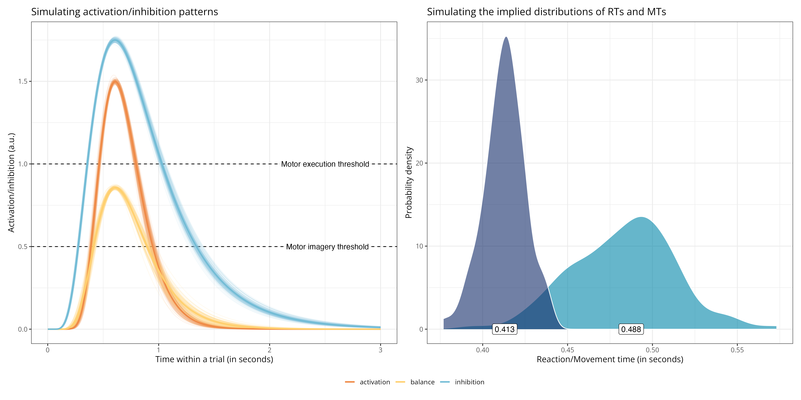

# Modelling the inhibitory mechanisms involved in motor imagery (work in progress)

A large body of behavioural, electrophysiological, and neuroimaging empirical evidence suggests that the motor system is involved during motor imagery. This raises the "problem of inhibition of execution": Given the role of the motor system in providing the multisensory content of motor imagery, how is it possible for motor imagery not to lead to motor execution? It has been proposed that this may be achieved by modulating (e.g., upregulating) the execution threshold. Alternatively, this may be achieved by parallel inhibitory processes preventing execution during motor imagery. We propose a toy model of the interplay between excitatory and inhibitory processes during motor imagery to disentangle the respective predictions of these propositions.

Activation and inhibition curves are modelled as a rescaled lognormal function to reflect patterns of excitatory and inhibitory activity within the motor system over time. The overall model structure is adapted from horse-race models of activation/inhibition patterns during response inhibition (e.g., [this paper](https://journals.plos.org/plosone/article?id=10.1371/journal.pone.0169320)). However, in the present model, the competition (the balance) between excitatory and inhibitory inputs is modelled throughout the entire trial to account for both reaction times (i.e., the time it takes to prepare and initiate execution/imagery) and movement times (i.e., the time it takes to execute/imagine an action).

## Fitting the model

This model can be fitted using functions within the present repository or using the associated `R` package (currently being developed) available at https://github.com/lnalborczyk/momimi.

## Exploring the model

An interactive Shiny application is available at: https://barelysignificant.shinyapps.io/motor_imagery_inhibition_model/.

## References

Nalborczyk, L., Longcamp, M., Gajdos, T., Servant, M., & Alario, F.-X. (*to be submitted*). Towards formal models of inhibitory mechanisms involved in motor imagery: A commentary on Bach, Frank, & Kunde (2022).
