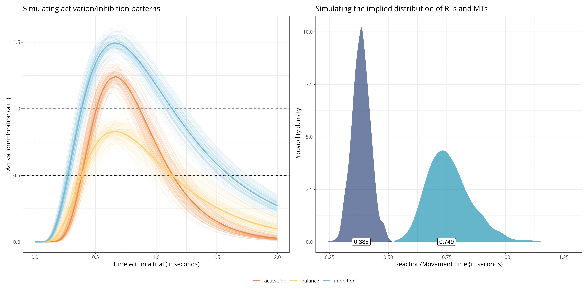

# Modelling activation/inhibition patterns during motor imagery (work in progress)

A large breadth of behavioural, electrophysiological, and neuroimaging empirical evidence suggests that the motor system is involved during motor imagery. This poses the "problem of inhibition of execution": Given the role of the motor system in providing the multisensory content of motor imagery, how is it possible for motor imagery not to lead to motor execution? It has been proposed that this may be achieved by modulating (e.g., upregulating) the execution threshold. Alternatively, this may be achieved by parallel inhibitory processes preventing execution during motor imagery. We propose a model of the interplay between excitatory and inhibitory processes during motor imagery to disentangle the respective predictions of these propositions.

Activation and inhibition curves are modelled as a lognormal base function (basically an unnormalised lognormal distribution), which is assumed to reflect the distribution of firing rates across a population of excitatory and inhibitory neurons (which is often found to be approximately lognormal, see for instance [this paper](https://www.nature.com/articles/nrn3687) or [this one](https://www.cell.com/neuron/fulltext/S0896-6273(11)00879-8)). The overall model structure is adapted from horse-race models of activation/inhibition patterns during response inhibition (e.g., [this paper](https://journals.plos.org/plosone/article?id=10.1371/journal.pone.0169320)). One important difference with these models, however, is that in the present model, the "race" does not stop at the execution threshold, but the competition (the balance) between activation and inhibition is modelled throughout the entire trial to account for both reaction times (i.e., the time it takes to prepare and initiate execution/imagery) and movement times (i.e., the time it takes to execute/imagine an action).

