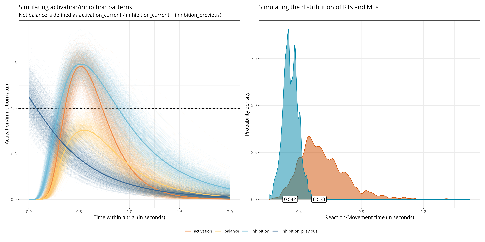

# Modelling activation/inhibition patterns during motor imagery (work in progress)

Modelling the impact of activation/inhibition patterns on RTs and MTs during motor imagery in action-mode switching paradigms. Activation and inhibition curves are modelled as a lognormal base function, which is hypothesised to (vaguely) reflect the distribution of firing rates across a population of excitatory and inhibitory neurons (which is often found to be approximately lognormal). The overall model structure is adapted from horse-race models of activation/inhibition patterns during response inhibition (e.g., https://journals.plos.org/plosone/article?id=10.1371/journal.pone.0169320). One important difference with these models, however, is that in the present model, the "race"" does not stop at the execution threshold, but the competition between activation and inhibition is modelled throughout the entire trial, to account for both reaction times (i.e., the time it takes to prepare execution/imagery) and movement times (i.e., the time it takes to execute/imagine an action).

